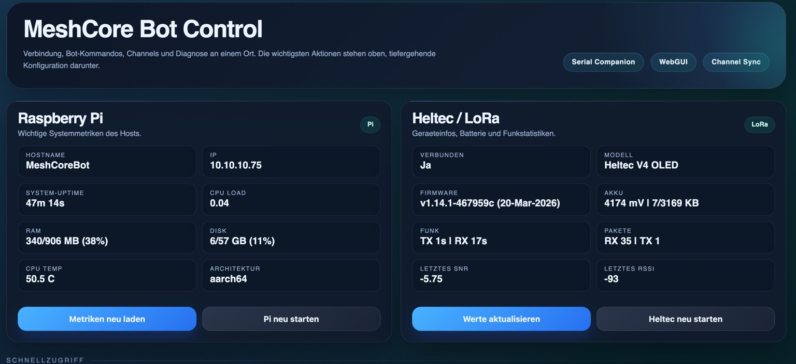

# 🛰️ MeshCore Bot Control Panel


🇩🇪 Deutsch | 🇬🇧 English

---

# 🇩🇪 Deutsch

## 📌 Beschreibung

Python-basierter MeshCore-Bot zur Steuerung von LoRa-Channels mit integrierter Telegram-Bridge und Webinterface.  
Das Projekt läuft auf einem Raspberry Pi in Kombination mit einem Heltec LoRa V4 (Serial Companion Firmware).

---

## ⚙️ Features

- 🤖 Telegram Bot Integration
- 🌐 Web Dashboard (Control Panel)
- 📡 LoRa Kommunikation (Heltec V4)
- 📊 System Monitoring (CPU, RAM, Uptime)
- 🔄 Remote Steuerung & Befehle
- 🔗 MeshCore Channel Management

---

## 📸 Vorschau



---

## 🧰 Hardware Voraussetzungen

- Raspberry Pi (empfohlen: Pi 4 oder Pi 5)
- Heltec LoRa V4
- USB-Verbindung zwischen Pi und Heltec

---

## 📦 Installation

```bash
git clone https://github.com/marcelmeir/meshcore_bot.git
cd meshcore_bot
chmod +x install.sh
./install.sh
```

---

## 🔧 Konfiguration

Beispielkonfiguration kopieren:

```bash
cp config.example.yaml config.yaml
```

Dann bearbeiten:

```yaml
telegram:
  token: "YOUR_TELEGRAM_BOT_TOKEN"
  chat_id: "YOUR_CHAT_ID"

meshcore:
  device: "/dev/ttyUSB0"
  baudrate: 115200

channels:
  - name: "default"
    key: "YOUR_CHANNEL_KEY"

web:
  port: 8080
```

---

## 🔑 Wichtige Variablen

### Telegram
- `token` → Bot Token von @BotFather
- `chat_id` → Deine Chat ID

### MeshCore
- `device` → Serielles Gerät (z. B. `/dev/ttyUSB0`)
- `baudrate` → Standard: `115200`

### Channels
- `name` → Channel Name
- `key` → MeshCore Schlüssel

### Web
- `port` → Port für Webinterface

---

## ▶️ Starten

```bash
python3 main.py
```

Dann im Browser öffnen:

```
http://<RASPBERRY_PI_IP>:8080
```

---

## 🛑 Sicherheit

- ❌ Niemals `config.yaml` committen
- ❌ Telegram Token geheim halten
- ❌ Channel Keys nicht veröffentlichen

---

## 📁 Projektstruktur

```
meshcore-bot/
├── main.py
├── install.sh
├── config.example.yaml
├── docs/
│   └── screenshots/
├── web/
├── bot/
└── README.md
```

---

# 🇬🇧 English

## 📌 Description

Python-based MeshCore bot for managing LoRa channels with an integrated Telegram bridge and web dashboard.  
Designed to run on a Raspberry Pi with a Heltec LoRa V4 (Serial Companion firmware).

---

## ⚙️ Features

- 🤖 Telegram bot integration
- 🌐 Web dashboard (control panel)
- 📡 LoRa communication (Heltec V4)
- 📊 System monitoring (CPU, RAM, uptime)
- 🔄 Remote control & commands
- 🔗 MeshCore channel management

---

## 📸 Preview


---

## 🧰 Hardware Requirements

- Raspberry Pi (recommended: Pi 4 or Pi 5)
- Heltec LoRa V4
- USB connection between Pi and Heltec

---

## 📦 Installation

```bash
git clone https://github.com/marcelmeir/meshcore_bot.git
cd meshcore_bot
chmod +x install.sh
./install.sh
```

---

## 🔧 Configuration

Copy example config:

```bash
cp config.example.yaml config.yaml
```

Edit the file:

```yaml
telegram:
  token: "YOUR_TELEGRAM_BOT_TOKEN"
  chat_id: "YOUR_CHAT_ID"

meshcore:
  device: "/dev/ttyUSB0"
  baudrate: 115200

channels:
  - name: "default"
    key: "YOUR_CHANNEL_KEY"

web:
  port: 8080
```

---

## 🔑 Important Variables

### Telegram
- `token` → Bot token from @BotFather
- `chat_id` → Your chat ID

### MeshCore
- `device` → Serial device (e.g. `/dev/ttyUSB0`)
- `baudrate` → Usually `115200`

### Channels
- `name` → Channel name
- `key` → MeshCore key

### Web
- `port` → Web interface port

---

## ▶️ Run

```bash
python3 main.py
```

Open in browser:

```
http://<RASPBERRY_PI_IP>:8080
```

---

## 🛑 Security

- ❌ Never commit `config.yaml`
- ❌ Keep your Telegram token private
- ❌ Do not share channel keys

---

## 📜 License

MIT License
